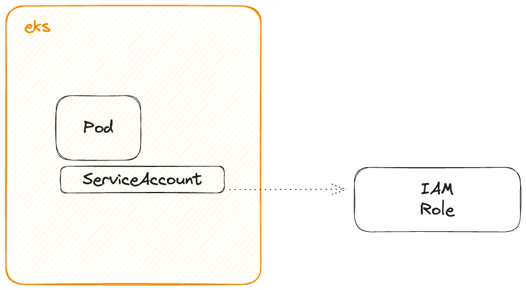
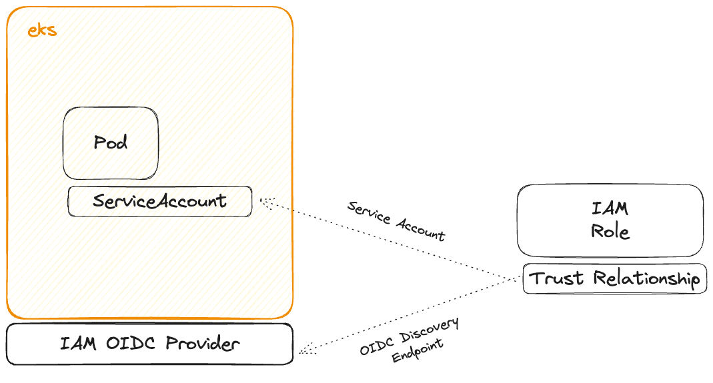
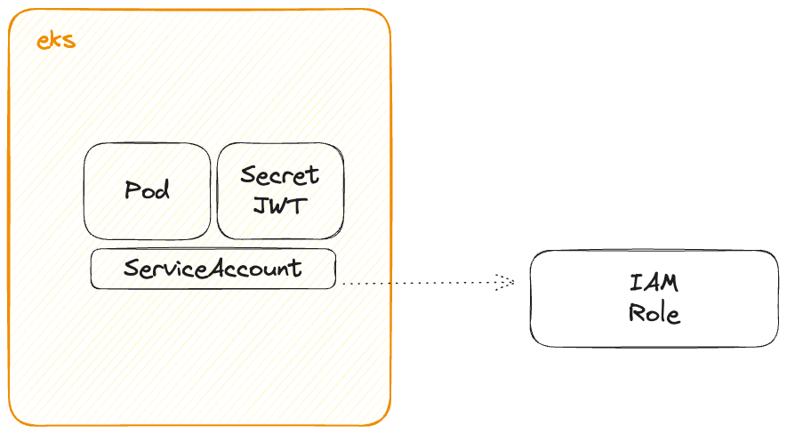
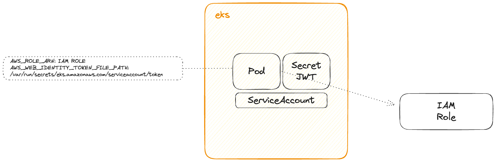
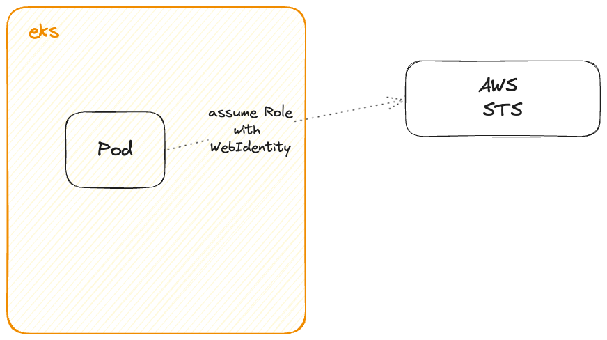
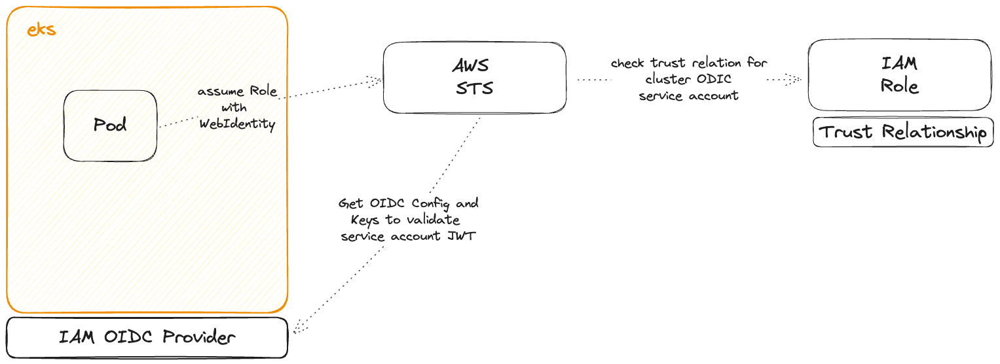
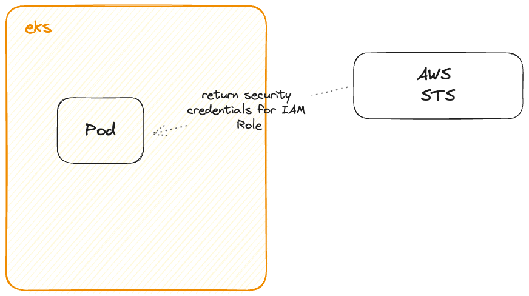

# AWS EKS IRSA Configuration

IRSA (IAM Roles for Service Accounts) is AWS EKS's method for allowing EKS pod applications to access the AWS API through specific AWS IAM roles.
This approach is more advanced than the previous method where applications in pods used the IAM roles of the EKS nodes.
Configuring AWS API access per service account aligns with the principle of least privilege, resulting in a more secure architecture.

IRSA integrates components from AWS IAM, OpenID Connect, Kubernetes Service Accounts, and Pods.
It involves several interconnected parts from these concepts.
Here's a simplified overview of how these elements work together to enable applications in a pod to utilize an IAM role.

# Configuration

This configuration is for implementing AWS IRSA, which involves creating the IAM Role, Policy, Attachment, and configuring the trust relationship between Kubernetes Service Account and AWS EKS OIDC Provider.
## The How



- A Pod where the application operates.
- A Service Account, marked with an annotation to indicate its use of an IAM Role.



- An IAM Role with a trust relationship directed towards:
    - The Kubernetes Service Account authorized to assume that role.
    - The AWS OIDC Provider for the EKS Cluster.
## Service Accounts and Service Accounts Tokens

Creating a Service Account in EKS also generates a Service Account Token.



- The Service Account Token is saved as a Kubernetes Secret in the same namespace.
- The token is a JSON Web Token (JWT).

## Attaching the Service Account to the Pod

When a Pod is configured to use a Service Account in EKS, several actions are automatically performed:



- The Service Account's JWT, which is stored in a secret, gets mounted in the Pod.
- The following environment variables are injected into the Pod:

```bash
AWS_ROLE_ARN=<IAM ROLE ARN>
AWS_WEB_IDENTITY_TOKEN_FILE=<PATH TO THE SERVICE ACCOUNT TOKEN>
```

## The assume role request

The AWS SDK, operating within the application inside the Pod, is programmed to reference these environment variables for authentication.
It sends a request to AWS STS to assume the IAM Role, including the Service Account JWT in that request.



The request will include:
- The ARN of the IAM Role
- The JWT of the Service Account

AWS STS will utilize the configuration in the IAM Role's Trust Relationship for validation.



- Verify that the Service Account JWT is valid and issued by the trusted OIDC Provider of the EKS Cluster.
- Confirm that the Service Account is authorized to assume the IAM Role.

## On Success

AWS STS will provide the application in the Pod with security credentials for the IAM Role, valid for 15 minutes.


